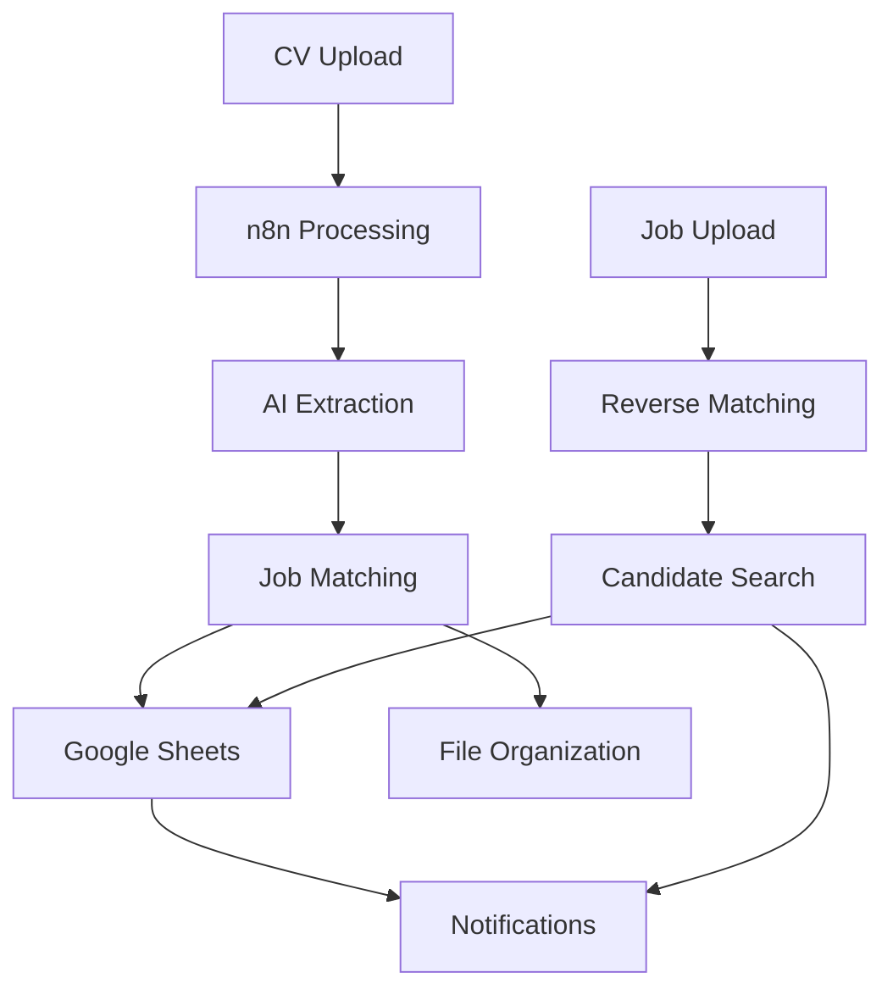

# Recruit8N - AI-Powered Recruitment Automation

🤖 **Automated CV Processing** • 🎯 **Smart Job Matching** • 📊 **Intelligent Analytics**

## Overview

Recruit8N is a comprehensive n8n-based automation system that revolutionizes recruitment workflows by leveraging AI to process CVs, match candidates to jobs, and manage your entire recruitment pipeline through Google Drive and Google Sheets integration.

### Key Features

- **🔄 Automated CV Processing**: Extract candidate data from any CV format
- **🎯 AI-Powered Matching**: 85%+ accuracy in candidate-job matching
- **📁 Smart File Organization**: Automatic sorting based on match quality
- **🔍 Alternative Job Suggestions**: Find opportunities for non-matching candidates
- **↩️ Reverse Candidate Matching**: Match existing candidates to new jobs
- **📊 Real-time Analytics**: Track performance and placement metrics
- **📧 Intelligent Notifications**: Automated alerts for high-priority matches
- **🌐 Multi-format Support**: PDF, DOC, DOCX, RTF, TXT files

## Quick Start

### Prerequisites
- n8n instance (cloud or self-hosted)
- Google Account (Drive + Sheets)
- OpenAI API access
- Email service (SMTP)

### Installation

1. **Clone or Download Files**
   ```bash
   # Download the project files to your local machine
   ```

2. **Set Up Google Drive Structure**
   - Follow `/templates/google-drive-folder-structure.md`
   - Create the required folder hierarchy
   - Note down all folder IDs

3. **Create Google Sheets**
   - Use templates in `/schemas/` folder
   - Set up 5 main sheets: Candidates, Jobs, Match Results, Alternative Matches, Reverse Matches
   - Note down sheet IDs

4. **Configure n8n**
   - Import workflows from `/workflows/` folder
   - Set up credentials (Google, OpenAI, SMTP)
   - Update folder and sheet IDs in workflows

5. **Test & Deploy**
   - Upload test CV to trigger processing
   - Verify data appears in Google Sheets
   - Check automated file organization

## System Architecture



## Workflow Components

### 1. Main CV Processing
- **Trigger**: New CV uploaded to Google Drive
- **Process**: Extract data → Match jobs → Save results → Organize files
- **Output**: Structured candidate data + match scores

### 2. Alternative Job Matching
- **Trigger**: Scheduled or manual
- **Process**: Find alternative roles for unmatched candidates
- **Output**: Alternative job suggestions with confidence scores

### 3. Reverse Candidate Matching
- **Trigger**: New job description uploaded
- **Process**: Match existing candidates against new role
- **Output**: Ranked list of suitable candidates

## File Structure

```
recruit8n/
├── workflows/                 # n8n workflow JSON files
│   ├── main-cv-processing.json
│   ├── alternative-job-matching.json
│   └── reverse-candidate-matching.json
├── schemas/                   # Google Sheets templates
│   ├── candidates-sheet-template.json
│   ├── job-vacancies-sheet-template.json
│   ├── match-results-sheet-template.json
│   ├── alternative-matches-sheet-template.json
│   └── reverse-matches-sheet-template.json
├── templates/                 # Prompt and email templates
│   ├── cv-parsing-prompts.json
│   ├── email-templates.json
│   └── google-drive-folder-structure.md
├── docs/                      # Documentation
│   ├── setup-guide.md
│   └── user-manual.md
├── config/                    # Configuration files
│   └── workflow-configuration.json
└── README.md
```

## Key Benefits

### For Recruiters
- **Time Savings**: 80% reduction in manual CV screening
- **Accuracy**: AI-powered matching with detailed reasoning
- **Organization**: Automated file management and data entry
- **Intelligence**: Smart alternative matching and insights

### For Agencies
- **Scalability**: Handle 100s of CVs simultaneously
- **Consistency**: Standardized evaluation criteria
- **Analytics**: Performance tracking and optimization
- **Client Service**: Faster turnaround and better matches

### For Candidates
- **Fair Evaluation**: Consistent, bias-free initial screening
- **Alternative Opportunities**: Suggestions for related roles
- **Faster Response**: Automated processing and feedback

## Data Extracted from CVs

### Personal Information
- Full name
- Contact details (email, phone, address)
- Professional summary

### Professional Data
- Current occupation
- Years of experience
- Employment history
- Key achievements

### Skills & Qualifications
- Technical skills
- Soft skills
- Education and certifications
- Languages and projects

## Matching Intelligence

### AI Analysis Framework
1. **Skill Alignment**: Required vs. candidate skills
2. **Experience Assessment**: Years and relevance
3. **Education Fit**: Degree requirements
4. **Career Progression**: Natural advancement path
5. **Industry Knowledge**: Sector-specific experience

### Match Scoring
- **90-100%**: Exceptional match - immediate interview
- **80-89%**: Strong match - high priority
- **70-79%**: Good match - suitable candidate
- **60-69%**: Moderate match - worth exploring
- **Below 60%**: Consider alternative roles

## Configuration

### Essential IDs to Configure
```json
{
  "google_drive_folders": {
    "new_cvs": "your-folder-id",
    "processing": "your-folder-id",
    "suitable_matches": "your-folder-id",
    "alternative_matches": "your-folder-id",
    "rejected": "your-folder-id",
    "active_jobs": "your-folder-id"
  },
  "google_sheets": {
    "candidates": "your-sheet-id",
    "jobs": "your-sheet-id",
    "match_results": "your-sheet-id",
    "alternative_matches": "your-sheet-id",
    "reverse_matches": "your-sheet-id"
  }
}
```

## API Requirements

### Google APIs
- Google Drive API (file management)
- Google Sheets API (data storage)

### OpenAI API
- GPT-4 model access
- Text processing and analysis

### SMTP Service
- Email notifications
- Alert system

## Performance Metrics

### Processing Speed
- CV processing: 30-60 seconds per file
- Job matching: 10-30 seconds per comparison
- Batch processing: 50+ candidates per job

### Accuracy Rates
- CV data extraction: 95%+ accuracy
- Job matching: 85%+ suitable recommendations
- Alternative matching: 78%+ relevant suggestions

## Support & Documentation

### Getting Started
1. Read the **Setup Guide**: `/docs/setup-guide.md`
2. Follow the **User Manual**: `/docs/user-manual.md`
3. Review **Configuration**: `/config/workflow-configuration.json`

### Troubleshooting
- Check n8n execution logs
- Verify Google Drive permissions
- Test API credentials
- Review file formats and naming

### Best Practices
- Maintain consistent file naming
- Regular data backup
- Monitor AI accuracy
- Update job requirements regularly

## Roadmap

### Planned Features
- [ ] Multi-language CV support
- [ ] Integration with job boards
- [ ] Advanced analytics dashboard
- [ ] Mobile app interface
- [ ] Video interview scheduling
- [ ] Candidate feedback system

### Version History
- **v1.0**: Initial release with core functionality
- **v1.1**: Enhanced AI prompts and error handling
- **v1.2**: Alternative matching improvements

## Contributing

We welcome contributions to improve Recruit8N:

1. Fork the repository
2. Create a feature branch
3. Make improvements
4. Submit a pull request

### Areas for Contribution
- AI prompt optimization
- Additional file format support
- UI/UX improvements
- Documentation enhancements
- Performance optimizations

## License

This project is licensed under the MIT License - see the LICENSE file for details.

## Support

For technical support or questions:
- Review documentation in `/docs/`
- Check configuration in `/config/`
- Consult n8n community resources
- Contact your system administrator

---

**Made with ❤️ for recruitment professionals who want to focus on building relationships, not processing paperwork.**

*Transform your recruitment process today with AI-powered automation.*